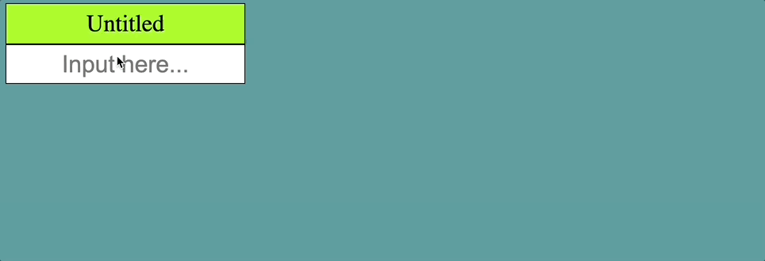
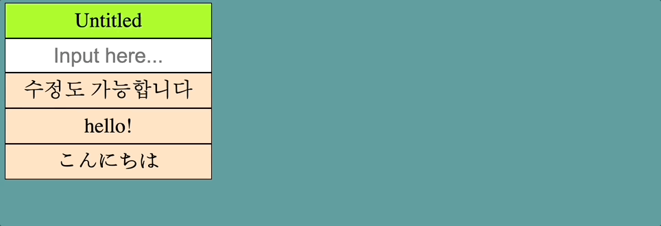
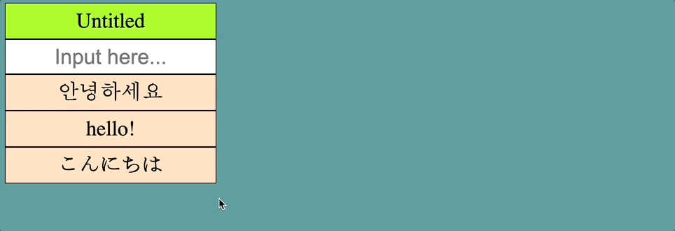
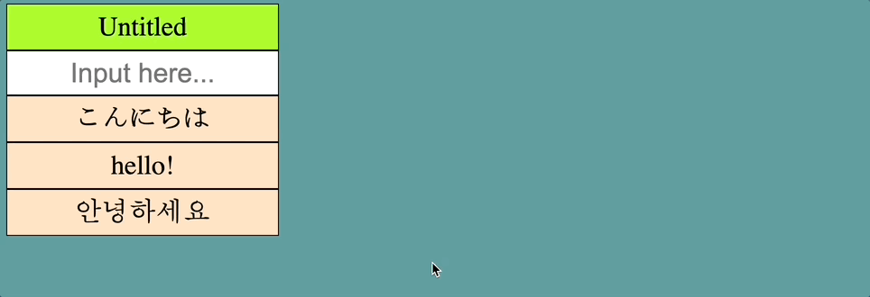
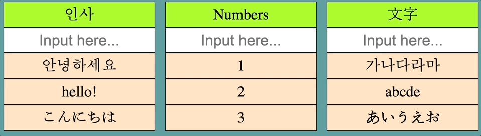
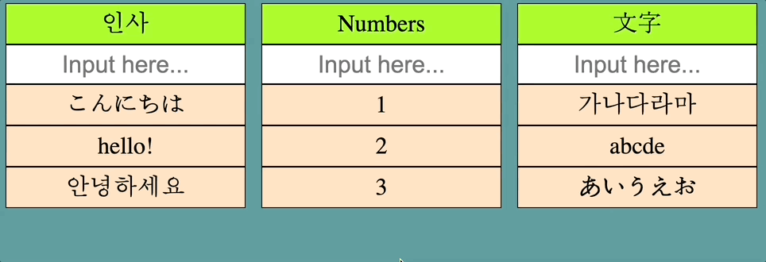
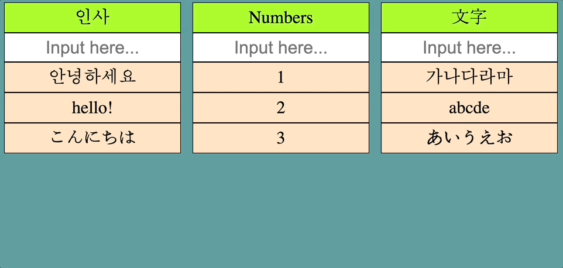

# draganddrop_frontend(en)

##### [한국어 버전은 이 곳을 클릭해주세요](README.md)

##### [日本語バージョンはこちらをクリックして下さい](README_JP.md)

## - Index -

1. Overview
2. Project goal
3. Features demo
4. Features for the next version
5. What needs to get fixed
    
    

### 1. Overview

- Project title : draganddrop_frontend
- Period : 2023.02.20 - 2023. 03. 03(12days)
- Member(s) : Dug Park
- Tech stack :  
      
   
   

### 2. Project goal

1. Creating a simple page which can manipulate DOM with DRAG & DROP function
2. Have to able to interact with backend server
3. Have to be considerate for user experience
    
    

### 3. Features demo  

1. Add content 
   
2. Modify content 
   
3. Remove content 
   
4. Modify contents order 
   
5. Add category 
   
6. Modify category 
   
7. Remove category 
   
8. Modify category order 
   
9. Move contents among categories 
   
    
    

### 4. Features for the next version

- Reviewing Adding Web Socket feature
   
   

### 5. What needs to get fixed

- Overall refactoring
