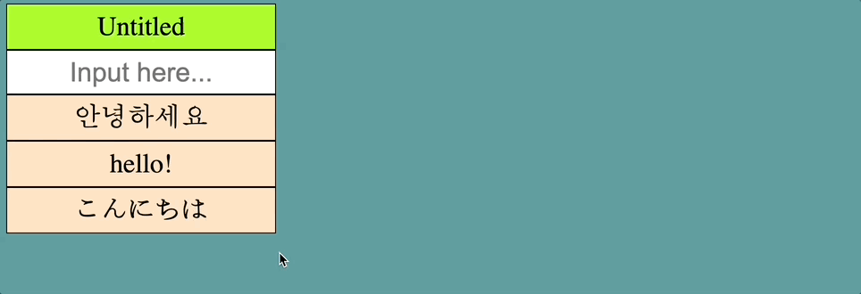
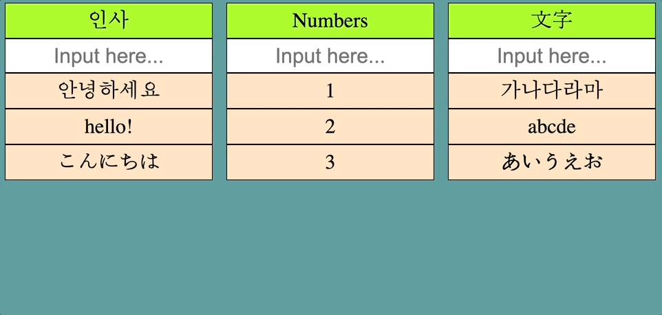

# draganddrop_frontend(jp)

##### [한국어 버전은 이 곳을 클릭해주세요](README.md)

##### [Click here for English version](README_EN.md)

## - 目次 -

1. 概要
2. Project 目標
3. 機能試演
4. 今後具現予定機能
5. 改善必要内容
    
    

### 1. 概要

- Project タイトル: draganddrop_frontend
- 期間 : 2023.02.20 - 2023. 03. 03(12 日)
- 人員 : 1 人
- 技術スタック :  
      
   
   

### 2. Project 目標

1. DRAG & DROP で DOM を操作出来るように具現する事
2. backend server との連動出来るように具現する事
3. 使用者の便利性を考慮して機能を追加する事
    
    

### 3. 機能試演  

1. content 追加 
   
2. content 修正 
   
3. content 削除 
   
4. content 順番変更 
   
5. category 追加 
   
6. category 修正 
   
7. category 削除 
   
8. category 順番変更 
   
9. category 間 content 移動 
   
    
    

### 4. 今後具現予定機能

- Web Socket 適用検討
   
   

### 5. 改善必要内容

- 全体的な refactoring
